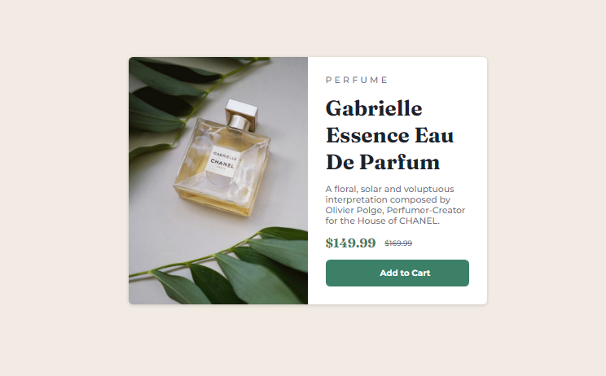

# Frontend Mentor - Product preview card component solution

This is a solution to the [Product preview card component challenge on Frontend Mentor](https://www.frontendmentor.io/challenges/product-preview-card-component-GO7UmttRfa). Frontend Mentor challenges help you improve your coding skills by building realistic projects.

## Table of contents

- [Overview](#overview)
  - [The challenge](#the-challenge)
  - [Screenshot](#screenshot)
  - [Links](#links)
- [My process](#my-process)
  - [Built with](#built-with)
  - [Continued development](#continued-development)
- [Author](#author)

**Note: Delete this note and update the table of contents based on what sections you keep.**

## Overview

### The challenge

Users should be able to:

- View the optimal layout depending on their device's screen size
- See hover and focus states for interactive elements

### Screenshot

### Links

- Solution URL: [https://github.com/Jerome-Nel/product-preview-card-component](https://your-solution-url.com)
- Live Site URL: [https://jerome-nel.github.io/product-preview-card-component/](https://your-live-site-url.com)

## My process

### Built with

- Semantic HTML5 markup
- CSS custom properties
- Flexbox
- Mobile-first workflow
- Desktop view

### Continued development

I want to continue focusing on responsive web design.

**Note: Delete this note and the content within this section and replace with your own plans for continued development.**

## Author

- Website - [Jerome Nel Populi](https://github.com/Jerome-Nel)
- Frontend Mentor - [@Jerome-Nel](https://www.frontendmentor.io/profile/Jerome-Nel)
